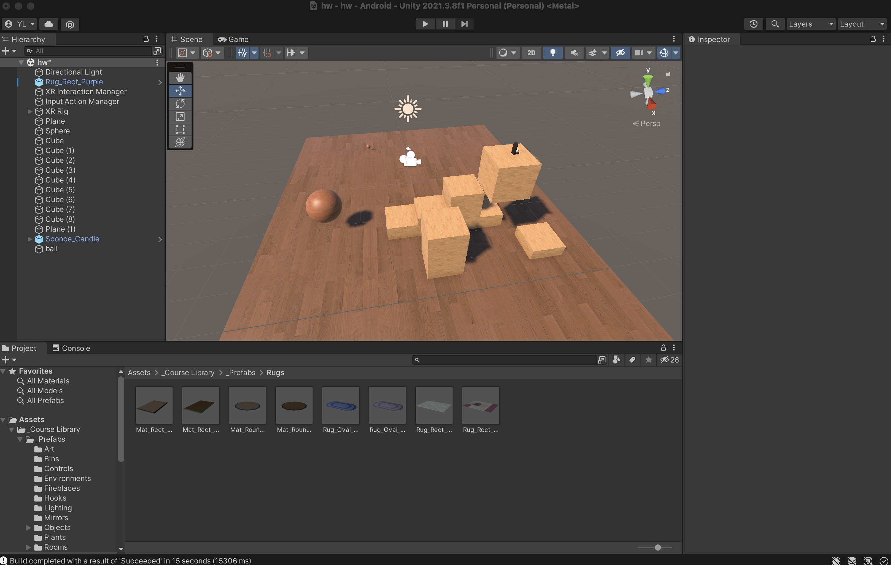
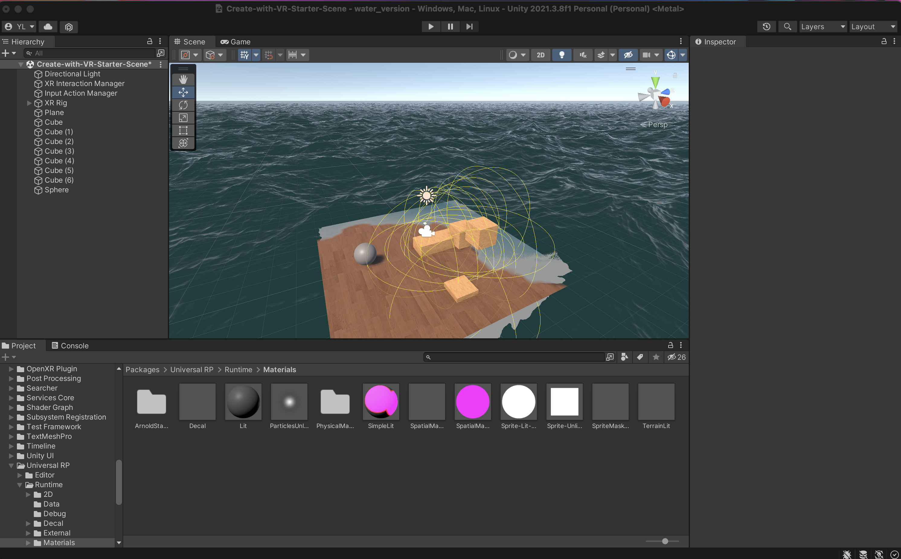

#
## VR Game
 Yuanbo Li

## Intro

This is a project to fulfill starter project for Brown Visual Computing Lab. The requirement is to "Find data beyond what the software comes with, import it, and visualize the data interactively in a VR headset."

## Project Design

There are two major parts of the work: 

1)A interactively game that can be played on VR headset. (I tested with my Oculus quest2)

2)A interactively game that have the previous game settled up in water. However, this one cannot be played on VR.

### Game 1

Player has two grababble bouncy ball, one with gravitity and knematic, one only have knematic. 
Player need to use these balls, either throw or put them somewhere, to help himself climb up the stairs. (Player is movable and can turn around). 
All boxs are rigid bodies with no gravitity but knematic.

This game can be played on quest2. 
 

<p\> 

### Game 2

This game is used to fulfill two requirements: 1)import some data 2)data of interest: fluid flow simulation.

I used [KWS water](https://assetstore.unity.com/packages/tools/particles-effects/kws-water-system-standard-rendering-191771) to simulate the ocean, and 

<p\> 

## Design

### Read Input
